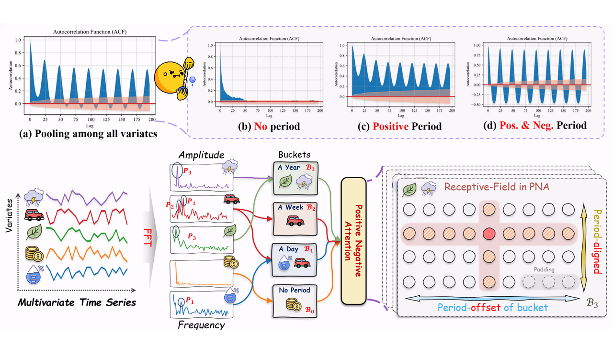

# PHAT: Modeling Period Heterogeneity for Multivariate Time Series Forecasting
This is the temperature repository of our ICLR 2026 paper. While existing multivariate time series forecasting models have advanced significantly in modeling periodicity, they largely neglect the periodic heterogeneity common in real-world data, where variables exhibit distinct and dynamically changing periods. To effectively capture this periodic heterogeneity, we propose **PHAT** (**P**eriod **H**eterogeneity-**A**ware **T**ransformer). Specifically, PHAT arranges multivariate inputs into a three-dimensional "**periodic bucket**" tensor, where the dimensions correspond to variable group characteristics with similar periodicity, time steps aligned by phase, and offsets within the period. By restricting interactions within buckets and masking cross-bucket connections, PHAT effectively avoids interference from inconsistent periods. We also propose a positive-negative attention mechanism, which captures periodic dependencies from two perspectives: periodic alignment and periodic deviation. Additionally, the periodic alignment attention scores are decomposed into positive and negative components, with a modulation term encoding periodic priors. This modulation constrains the attention mechanism to more faithfully reflect the underlying periodic trends. A mathematical explanation is provided to support this property. We evaluate PHAT comprehensively on 14 real-world datasets against 18 baselines, and the results show that it significantly outperforms existing methods, achieving highly competitive forecasting performance.

## 1. Introduction about the code
### 1.1 Coding Framework
All of our experiments are running on the [benchmark](https://github.com/decisionintelligence/TFB) framework. To run PHAT, you need to configure your environment and datasets according to their requirements. Then put this temperature repository in the `ts_benchmark/baselines/`.

 

## 2. Environmental Requirments
The experiment requires the same environment as [benchmark](https://github.com/decisionintelligence/TFB).
